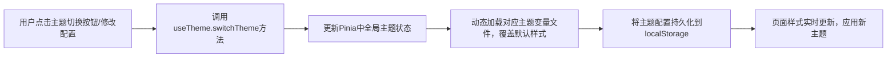

# 执行顺序
技术栈（全部下载安装好）->构建项目架构目录（空目录、空文件）->全局系统设置->特殊页面->前台展示系统->认证与安全模块->后台管理系统->总结文档
附加要求：
1. 全程使用中文编写所有文档和代码注释
2. 生成优先级排序的结构化问题清单（输出至docs/Analysis.md）
3. 确保任务计划覆盖所有需求，每个模块任务都需要分开很多的子任务进行细化操作，必须确保足够细和文档内容完整无缺失
4. 所有的开发，组件如没有详细要求，统一使用UI 组件库的heroui进行开发，包括表单、卡片等，图标默认使用react-icons库，数据可视化使用ant-design/plots库，请了解所有UI组件库以及动态组件库的所有组件使用方法后再进行开发
5. 每个节点完成后需必须更新CSS样式、完善路由配置确保界面效果可见
6. 每个开发节点都需进行测试验证，包括但不限于构建测试、控制台错误检查等等，确保代码质量和功能正常，确保每一次运行时都正常，要让用户能够正常使用浏览给出功能建议
7. API对接需记录：接口地址、请求参数、测试案例、精简待办事宜（输出至docs/TODO_[任务名].md）
# 技术栈
## 技术栈浏览
- 核心框架（核心）：React@19.2.0
- 构建工具 （核心）：vite@7.2.4
- 类型校验（核心）：typescript@5.9.3
- 样式处理（核心）：tailwindcss@4.1.18 (@tailwindcss/vite)
- UI组件库（核心）：@heroui/react@2.8.7 
- 图标库（核心）：react-icons@5.5.0
- 数据可视化（核心）：@ant-design/plots@2.6.8 (AntV G2Plot)
- 3D 渲染：Three.js@0.182.0, @react-three/fiber, @react-three/drei
- UI动态组件库（核心）：React Bits (Source), Magic UI (Source), framer-motion@12.24.10
- 验证码组件（核心）：rc-slider-captcha@latest
- 路由管理：React Router v7.11.0
- 状态管理：Zustand@5.0.9
- 数据获取：axios@1.13.2
- 国际化：Vite-plugin-auto-i18n@0.0.9
- 移动端适配：postcss-pxtorem@6.1.0 + amfe-flexible@2.2.1
- 媒体播放：react-player@3.4.0
- 富文本与编辑器：draft-js@0.11.7 + @draft-js-plugins/editor@4.1.4
- 其他辅助工具：lodash@4.17.21、dayjs@1.11.19、js-cookie@3.0.5、react-use@17.6.0、clsx@2.1.1、tailwind-merge@3.4.0
# 项目架构目录
```vue
your-react-project/          # 项目根目录
├── public/                  # 静态资源（不会被 Vite 编译，直接拷贝）
│   ├── favicon.ico          # 网站图标
│   ├── fonts/               # 自定义字体
│   ├── logo/                # 品牌 logo 资源
│   ├── Thumbnail/           # 缩略图 资源
│   ├── Rotation/            # 轮换图 资源
│   └── mock/                # 本地 mock 数据（可选）
├── src/                     # 项目核心源码
│   ├── api/                 # 接口请求层（统一管理接口）
│   │   ├── modules/         # 按业务模块划分接口
│   │   │   ├── user.ts      # 用户模块接口
│   │   │   └── dashboard.ts # 仪表盘模块接口
│   │   ├── axios.ts         # axios 实例配置（拦截器、请求头、超时等）
│   │   └── types.ts         # 接口返回值类型定义
│   ├── assets/              # 静态资源（会被 Vite 编译处理）
│   │   └── styles/          # 全局样式
│   ├── components/          # 通用组件层（非业务耦合）
│   │   ├── Editor/          # 富文本编辑器通用组件（基于 draft-js 封装）
│   │   ├── MediaPlayer/     # 媒体播放通用组件（基于 react-player 封装）
│   │   ├── Motion/          # React Bits/Magic UI 动画通用组件,下载统一位置（如动效按钮、过渡容器）
│   │   └── UI/              # Hero UI 二次封装组件（如自定义表格、弹窗）
│   ├── hooks/               # 自定义 Hooks 层（复用业务逻辑）
│   │   ├── useAxios.ts      # 接口请求 Hooks（封装 loading/error 处理）
│   │   ├── useMedia.ts      # 媒体播放 Hooks（基于 react-player）
│   │   ├── useMotion.ts     # React Bits 动效 Hooks
│   │   └── useStorage.ts    # 本地存储 Hooks（Cookie/localStorage）
│   ├── layouts/             # 布局组件层
│   │   ├── BasicLayout/     # 基础布局（侧边栏+头部+内容区）
│   │   ├── BlankLayout/     # 空白布局（登录/404 页面用）
│   │   └── MobileLayout/    # 移动端适配布局
│   ├── pages/               # 业务页面层（按模块划分）
│   │   ├── Dashboard/       # 仪表盘模块
│   │   │   ├── components/  # 页面内私有组件（仅当前页面使用）
│   │   │   ├── index.tsx    # 页面入口
│   │   │   └── types.ts     # 页面私有类型定义
│   │   ├── Login/           # 登录模块
│   │   ├── User/            # 用户模块
│   │   └── 404/             # 404 页面
│   ├── router/              # 路由配置层
│   │   ├── index.ts         # 路由入口（创建路由实例、路由守卫）
│   │   ├── routes.ts        # 路由规则定义（静态路由）
│   │   └── types.ts         # 路由类型定义
│   ├── store/               # 状态管理层（Zustand）
│   │   ├── modules/         # 按模块划分 store
│   │   │   ├── userStore.ts # 用户状态
│   │   │   └── appStore.ts  # 应用全局状态（主题、布局等）
│   │   └── index.ts         # store 导出入口（统一导出便于使用）
│   ├── types/               # 全局类型定义（TS 专属）
│   ├── utils/               # 通用工具函数层
│   │   ├── cookie.ts        # Cookie 操作（基于 js-cookie 封装）
│   │   ├── date.ts          # 时间处理（基于 dayjs 封装）
│   │   └── format.ts        # 格式化工具（数字、字符串、金额等）
│   ├── App.tsx              # 应用根组件
│   ├── main.tsx             # 项目入口文件（挂载 React 根节点）
│   └── vite-env.d.ts        # Vite TS 类型声明（自动生成）
├── .eslintrc.cjs            # ESLint 配置
├── .prettierrc.cjs          # Prettier 配置
├── index.html               # Vite 入口 HTML
├── package.json             # 依赖配置
├── tsconfig.json            # TS 配置
├── vite.config.ts           # Vite 构建配置
└── README.md                # 项目说明文档
```

## package.json

```json
{
    "name": "zx-ui",
    "private": true,
    "version": "0.0.0",
    "type": "module",
    "scripts": {
        "dev": "vite",
        "build": "tsc -b && vite build",
        "lint": "eslint .",
        "preview": "vite preview"
    },
    "dependencies": {
        "@ant-design/plots": "^2.6.8",
        "@draft-js-plugins/editor": "^4.1.4",
        "@heroui/react": "^3.0.0",
        "@motionone/utils": "^10.18.0",
        "@react-three/drei": "^10.7.7",
        "@react-three/fiber": "^9.5.0",
        "@tailwindcss/vite": "^4.1.18",
        "amfe-flexible": "^2.2.1",
        "axios": "^1.13.2",
        "clsx": "^2.1.1",
        "dayjs": "^1.11.19",
        "draft-js": "^0.11.7",
        "framer-motion": "^12.24.10",
        "js-cookie": "^3.0.5",
        "lodash": "^4.17.21",
        "rc-slider-captcha": "^1.9.0",
        "react": "^19.2.0",
        "react-dom": "^19.2.0",
        "react-icons": "^5.6.0",
        "react-player": "^3.5.0",
        "react-router-dom": "^7.12.0",
        "react-use": "^17.6.0",
        "tailwind-merge": "^3.4.0",
        "tailwindcss": "^4.1.18",
        "three": "^0.182.0",
        "zustand": "^5.0.9"
    },
    "devDependencies": {
        "@eslint/js": "^9.39.1",
        "@types/draft-js": "^0.11.20",
        "@types/js-cookie": "^3.0.6",
        "@types/lodash": "^4.17.21",
        "@types/node": "^24.10.4",
        "@types/postcss-pxtorem": "^6.1.0",
        "@types/react": "^19.2.5",
        "@types/react-dom": "^19.2.3",
        "@types/three": "^0.182.0",
        "@vitalets/google-translate-api": "^9.2.1",
        "@vitejs/plugin-react": "^5.1.1",
        "eslint": "^9.39.1",
        "eslint-plugin-react-hooks": "^7.0.1",
        "eslint-plugin-react-refresh": "^0.4.24",
        "globals": "^16.5.0",
        "json-format": "^1.0.1",
        "postcss-pxtorem": "^6.1.0",
        "tunnel": "^0.0.6",
        "typescript": "~5.9.3",
        "typescript-eslint": "^8.46.4",
        "vite": "^7.2.4",
        "vite-plugin-auto-i18n": "^0.0.9"
    }
}

```


## 下载或者copy

### reactbits和magicui
指定下载到src/components/Motion/分开独立维护
#### reactbits（src/components/Motion/react-bits）
到reactbits的官网下进行下载，比如Animated Content的是npx shadcn@latest add @react-bits/AnimatedContent-JS-CSS，以此类推
- Animated Content
- Animated List
- Fuzzy Text
- Masonry
- Scroll Stack
- Scroll Float
- Logo Loop
- True Focus
- Click Spark
- Animated Content
- Stepper
- Staggered Menu
- Scroll Velocity
- Sticker Peel
#### magicui（src/components/Motion/magic-ui）
到magicui的官网下进行下载，比如Word Rotate的是npx shadcn@latest add @magicui/word-rotate，以此类推
- Word Rotate
- Interactive Hover Button
### 图片
- 当前目录下的docs\image\知识库小破站V3.assets\3E437F1C6B2FD8E54ACA429E7FDBE63D.gif，复制到public/loading/下，并改名为Loading
- 当前目录下的docs\image\知识库小破站V3.assets\知识库小破站V3-20260107172215.png，复制到public/logo/下，并改名为MyLogo
### 字体
- 当前目录下的docs\fonts\ark-pixel复制到public\fonts\ark-pixel下

# 全局系统设计
## 主题定制系统
### 核心功能
1. 主题风格
	1. 浅色：默认基础风格，高对比度、高亮度，适配日常办公、强光环境下的视觉体验。
	2. 深色：低亮度、低蓝光配色，减少屏幕反光，适配夜间办公、长时间使用场景，降低视觉疲劳。
	3. 系统：自动跟随操作系统的主题设置（浅色 / 深色）实时切换，无需手动调整；若用户曾自定义主题风格，优先保留用户手动设置，同时提供 “恢复跟随系统” 选项，兼顾系统一致性与个性化需求。
2. 菜单布局
	1. 垂直：侧边栏菜单垂直排列于页面左侧，菜单项从上至下展示，层级关系通过缩进区分，适配菜单层级多、需清晰展示功能分类的后台管理场景。
	2. 水平：菜单横向排列于页面顶部，一级菜单平铺展示，二级及以上菜单通过下拉方式呈现，节省左侧空间，适配菜单层级少、需最大化展示内容区的场景。
	3. 混合：顶部展示核心一级菜单，左侧垂直展示当前一级菜单下的子菜单，兼顾菜单层级管理与内容区展示效率，适配中大型后台管理系统的复杂菜单结构。
	4. 双列：左侧侧边栏分为两列布局，首列展示核心功能入口（首页、系统设置等），次列展示当前模块的细分菜单，适用于菜单分类明确、需快速切换功能模块的场景。
3. 国际化（使用Vite-plugin-auto-i18n）
	1. 中文：界面内容全量切换为简体中文展示
	2. English：界面内容全量切换为英文展示
4. 主题配色
	- 预设选项包含#537BF9（默认）、#54B83E、#7E0DF5、#FF7416、#FF98C3 等色系，同时支持手动输入十六进制 / RGB 格式的自定义色值；主题色应用于按钮、菜单高亮、卡片边框、选中状态等核心交互元素，还可同步调整图表（曲线图、柱状图）的线条 / 填充色，保证全局视觉风格统一；输入自定义色值后实时预览效果，确认后保存生效。
5. 盒子样式
	1. 边框：允许 / 禁止；开启时，卡片、输入框、按钮等组件展示预设样式的边框（颜色适配主题色 / 主题风格），增强元素边界感；关闭时隐藏所有组件边框，界面更简洁，仅通过间距、阴影区分元素层级。
	2. 阴影：允许 / 禁止；开启时，卡片、弹窗、下拉菜单等组件展示柔和的层级阴影，增强界面立体感；关闭时移除所有阴影效果，界面呈现扁平化风格，适配极简视觉需求。
6. 自定义布局模式
	1. 开启多标签页：显示 / 隐藏；显示时顶部展示已打开的标签页，支持切换、关闭单个 / 全部标签，记录浏览历史；隐藏时仅展示当前页面内容，简化布局。
	2. 面包屑导航显示：显示 / 隐藏；显示时顶部展示当前位置的层级导航，支持点击返回上级页面；隐藏时移除面包屑，节省顶部空间。
	3. 侧边栏开启手风琴：显示 / 隐藏；开启时仅展开当前选中一级菜单的子菜单，其余折叠，简化菜单展示；关闭时所有有子菜单的一级菜单默认展开。
	4. 文字选中功能：允许 / 禁止；允许时可选中页面文字（表格、文案等）复制；禁止时屏蔽选中功能，保护内容版权。
	5. 色弱模式：关闭 / 开启；开启后调整界面色彩对比度、饱和度，优化色弱用户对颜色的识别度（如主题色、图表颜色），保证功能可用。
	6. 自定义菜单宽度：160px-300px（滑块调节）；滑块拖动实时调整侧边菜单宽度，最小值保证菜单文字完整展示，最大值适配长菜单名称，调整后即时生效。
	7. 自定义圆角：0px-24px（滑块调节）；控制所有组件（卡片、按钮、弹窗等）的圆角大小，0px 为直角，24px 为大圆角，实时预览调整效果。
	8. 字体大小：12px/14px（默认）/16px/18px；全局调整界面文字大小（菜单、文案、表格等），切换后即时生效，适配不同阅读习惯。
	9. 内容区边距：8px/16px（默认）/24px；调整内容区与菜单、页面边框的间距，8px 适配紧凑布局，24px 适配宽松布局。
	10. 页面切换动效：下拉框选项（淡入淡出 / 滑入滑出 / 缩放渐变 / 层级切换）；选择后路由切换展示对应过渡动画，时长统一为 300ms，无需求可选择关闭。
	11. 点击交互：允许/禁止；开启后使用reactbits的Click Spark（目录：src/components/Motion/）
### 设计风格
1. 通过「系统设置」按钮唤起配置面板
	1. 使用reactbits的Staggered Menu（目录：src/components/Motion/）
	2. Accent Color受到主题的主题色控制
	3. Menu Button Color受到主题控制，浅色为白色，深色为黑色
2. 支持实时预览配置效果并保存生效：调整任意配置项（如主题色、圆角、菜单宽度）后，页面无需刷新即时展示效果；面板底部设 “保存设置”“重置默认” 按钮，保存后配置偏好存储至本地缓存，下次登录自动加载；重置按钮可一键恢复默认值，并有二次确认提示避免误操作。
3. 配置面板按功能模块分栏展示：主题风格、菜单布局、国际化、主题配色、盒子样式、自定义布局模式六大模块独立分栏，各模块设折叠 / 展开按钮；模块标题采用加粗的方舟像素字体，搭配主题色下划线标识，模块间通过细分割线区分，视觉层级清晰。
4. 菜单布局配置项仅展示于后台管理场景：前台展示页面隐藏该配置，避免非目标场景的功能冗余；切换布局后给出 “布局已更新，部分菜单需重新加载” 的轻量提示，保证体验流畅。
5. 图标按钮全局主题适配：配置面板内所有图标按钮（收起 / 展开、保存、重置等）的颜色、hover / 选中状态均适配当前主题风格与主题色，浅色模式下图标为深灰色，深色模式下为浅灰色，交互状态切换为主题色，保证视觉一致性。
6. 样式变量文件拆分：按主题类型拆分`styles/light.css`、`styles/dark.css`文件，分别维护浅 / 深色模式下的背景色、文字色、边框色等变量；自定义主题色通过 CSS 变量注入，覆盖默认值实现全局样式快速更新，避免样式冗余。
7. 全局字体采用方舟像素字体
8. 全局，只有图标时，每点击图标，图标都会旋转一下
9. 响应式适配：配置面板在桌面端为右侧抽屉式（宽度 360px），平板端为底部弹出式，移动端为全屏弹窗式；所有交互控件（滑块、开关、下拉框）适配触屏操作，滑块支持手指拖动，开关支持点击切换，保证多终端操作便捷。
### 主题切换流程



## 全局字体设置
使用public\fonts\ark-pixel目录下的字体

## 编辑器系统

### 核心功能
1. 双模式编辑: 富文本/Markdown（支持一键切换）
2. 实时保存草稿(每3秒自动保存，避免内容丢失)
3. 版本历史管理(记录编辑历史版本，支持回滚)
4. 代码高亮(支持多种编程语言代码块高亮展示)
5. 图片粘贴/拖拽上传(支持批量上传，自动压缩优化)
6. 文章模板系统(内置多种文档模板，快速创建内容)
7. 拖动本地Markdown能快速导入编写
8. 大文件 / 长文本优化：编辑超 10000 字的长文本或批量上传超 10 张图片时，自动开启「轻量模式」（关闭实时渲染、禁用复杂动效），降低内存占用，避免编辑器卡顿；
### 设计风格
- 视觉层面：采用极简轻量化的设计基调，编辑器主体以中性浅色调（白色 / 浅灰）为基底，编辑区域与功能操作区通过细微的边框和间距实现视觉分层，无冗余装饰元素，聚焦内容编辑核心场景；工具栏选用扁平化功能图标，搭配简洁的文字提示，hover 状态呈现柔和的品牌色渐变反馈，既保证操作辨识度，又避免视觉干扰；富文本 / Markdown 模式切换按钮采用高对比度的品牌主色设计，且标注当前激活模式，帮助用户快速识别并切换编辑模式。
- 交互层面：遵循 “无感知干扰” 原则，实时保存草稿时仅在编辑器右上角展示轻量级加载动效 + 短暂的文字提示（“草稿已自动保存”），提示信息自动消失，不打断用户编辑流程；版本历史管理采用抽屉式侧边栏交互，展开 / 收起伴随平滑的过渡动画，版本回滚操作后提供即时的内容预览反馈，确认无误后再完成替换；图片上传支持粘贴 / 拖拽双方式，拖拽时编辑器区域显示半透明占位提示框，上传过程中展示进度条与缩略图预览，完成后自动嵌入编辑区域，批量上传时支持按顺序排列与单独删除；本地 Markdown 文件拖拽导入时，编辑器自动识别文件格式并解析内容，导入完成后给出 “文件导入成功” 的轻量提示。
- 响应式适配：针对不同终端设备做分层适配，桌面端展示完整工具栏与侧边版本管理区，最大化编辑操作效率；平板端自动折叠侧边版本区为悬浮按钮，工具栏保留核心功能按钮，次要功能收纳至下拉菜单；手机端将工具栏转为底部功能栏，编辑区域占满屏幕可视区，确保小屏场景下的内容可读性与操作便捷性。
- 主题适配：支持浅色 / 深色模式全局适配，编辑器的背景色、文字色、代码高亮样式、工具栏图标色均随主题同步切换，深色模式下降低文字与背景的对比度，减少视觉疲劳，保证不同主题下的编辑体验一致性。
- 一致性体验：编辑器操作逻辑对齐主流工具（如 Typora、VS Code），支持常见编辑快捷键（如 Ctrl+B 加粗、Ctrl+I 斜体等），右键菜单提供常用编辑操作选项，降低用户学习成本；文章模板系统的预览样式与最终编辑完成后的展示样式保持统一，模板选择界面采用卡片式布局，hover 时展示模板预览，点击后快速填充至编辑区域。

## 全局视频播放器
基于 @vidstack/react 实现核心播放功能，同时进行深度定制化开发，具体功能如下
	1. 章节导航：点击标记点快速跳转至对应章节起始时间，跳转时进度条触发 “主题色冲刺动效”（从当前进度向目标进度快速填充），同时短暂显示章节名称提示；无章节数据时自动隐藏标记点区域，避免界面冗余。
	2. 互动功能：设弹幕开关与透明度调节滑块（0%-100%），弹幕文字颜色自动规避与背景色相近的低对比度色值，字号适配全局字体大小；发送弹幕输入框支持 emoji、文字输入，发送后弹幕从右至左匀速滚动，动效流畅无卡顿。弹幕密度可调节（稀疏 / 正常 / 密集），避免遮挡视频核心内容；
	3. 基础播放功能：支持倍速播放（0.5x/1x/1.25x/1.5x/2x）、全屏 / 退出全屏、画中画模式（浏览器支持时显示）、画质切换（标清 / 高清 / 超清，根据视频源自动适配可选画质）；所有功能按钮 hover 时显示文字提示，提示框样式适配全局主题。
	4. 体验优化：内置播放记忆功能（下次打开自动跳转至上次观看进度），视频缓冲时展示主题色环形加载动效，无网络时显示 “加载失败，请检查网络” 提示并提供重试按钮。
	5. 历史记录：原定使用 react-player，因存在黑屏及 unmount 报错问题，已迁移至 @vidstack/react。

## API 封装与拦截处理
### 核心功能

1. 明确参数、返回值类型，补充注释
2. 支持单独配置超时、请求头（覆盖全局）。_对接后端响应格式：`{ code: number; msg: string; data: T }`_
3. 自动添加全局通用请求头（如 Token、设备标识、接口版本号、用户 ID、用户名字）
4. 请求参数格式化（空值过滤、数据类型转换）
5. 每个需要与后端对接 API 的都存放到 / API 目录下对应位置
### 设计与实现规范
1. 类型定义：基于 TypeScript 完成所有 API 的参数、返回值类型定义，统一放置在 / API/types 目录下，每个业务模块的类型单独文件管理，注释需包含参数说明、可选 / 必选标识、返回值含义，便于团队协作与维护。
2. 配置优先级：全局请求配置（如默认超时时间、全局请求头）在 / API/config.ts 中统一维护，单个 API 可通过配置项覆盖全局设置，优先级为 “单个 API 配置> 全局配置”，满足不同接口的个性化需求。
3. 请求拦截处理：请求发出前自动拦截并注入全局通用请求头，同时执行参数格式化逻辑，过滤空字符串、null、undefined 等无效参数，将非标准数据类型（如日期对象）转换为后端可识别的字符串格式，减少接口调用异常。
4. 响应拦截处理：统一拦截后端响应，先校验响应格式是否符合`{ code: number; msg: string; data: T }`规范，再根据 code 值做通用处理（如 code=401 时自动跳转登录页，code=500 时展示全局错误提示），最终返回标准化的响应数据，简化业务层的异常处理逻辑。
5. 目录结构：/API 目录按业务模块划分子目录（如 / API/editor/、/API/user/、/API/version/），每个模块下包含对应的请求函数文件与类型定义文件，确保 API 管理的结构化与可维护性。


## 防抖设置
### 核心功能
1. **搜索框实时搜索**：当用户在搜索框中输入内容时，通常需要实时进行搜索。使用防抖函数可以延迟搜索请求的发送，只在用户停止输入一段时间后才真正发送请求，避免频繁的请求操作。  
2. **表单输入验证**：在表单输入过程中，每次用户输入都可能触发验证操作。使用防抖函数可以延迟触发验证操作，只在用户输入完毕一段时间后进行验证，避免频繁的验证操作。  
3. **浏览器窗口调整事件**：当用户调整浏览器窗口大小时，会触发`resize`事件。使用防抖函数可以延迟`resize`事件的触发，只在用户停止调整窗口一段时间后才执行对应的操作，避免频繁的计算和布局操作。  
4. **鼠标移动事件**：在一些特定的交互场景中，需要根据鼠标的移动位置做出相应的交互。使用防抖函数可以延迟鼠标移动事件的触发，只在用户停止移鼠标一段时间后才执行相应的操作，避免过度频繁的操作。
### 设计风格
- 防抖函数封装：统一封装防抖工具函数至 /utils/debounce.ts，支持自定义延迟时间（默认 300ms）、是否立即执行等参数，确保全项目防抖逻辑的一致性。
- 场景化配置：针对不同场景设置差异化延迟时间，搜索框实时搜索默认 300ms，表单输入验证默认 200ms，窗口 resize 与鼠标移动事件默认 500ms，适配不同交互场景的响应需求。
- 取消机制：防抖函数返回取消执行的方法，在组件卸载前调用取消方法，避免组件销毁后仍执行防抖回调导致的内存泄漏或逻辑异常。

# 特殊页面
## 404页面
一共三层
1. 第一层
	使用ReactBits的Fuzzy Text编写错误信息（目录：src/components/Motion/）+HeroUI的404报错图标
2. 第二层
	使用使用reactbits的True Focus显示字体（目录：src/components/Motion/），“页面”和“找不到了...”
3. 第三层
	返回首页按钮+图标
## 尚未开发页面
使用ReactBits的Scroll Velocity编写（目录：src/components/Motion/），字体为“尚未开发”
## 跨页面跳转过渡
一共二层
- 第一层
	使用使用reactbits的True Focus显示字体（目录：src/components/Motion/），“欢迎回来”和“Loading....”
- 第二层
	使用public/loading/Loading.gif
### 实现逻辑
- 基于 React Router 的路由过渡动画能力，结合该动效图片实现页面跳转时的渐变 + 动效过渡，过渡时长与动效时长保持一致（约 500ms），确保动效完整展示；跳转触发时先展示该动效，待动效结束后加载目标页面内容，提升页面切换的流畅度与趣味性
- 只用登录后切换后台才会展示
## 备忘录便签
### 核心交互
- 尺寸调整：支持通过便签右下角的拖拽手柄实现伸缩小窗口，拖拽过程中实时更新便签尺寸，释放后保存当前尺寸至本地缓存，下次打开时恢复至上次调整的尺寸；
- 视觉反馈：拖拽调整尺寸时，便签边框呈现高亮状态，拖拽手柄有明显的视觉标识，调整过程中无卡顿，尺寸边界设置最小 / 最大值（最小宽高 200px，最大宽高 800px），避免尺寸异常；
- 布局适配：便签缩放后，内部文字自动换行适配，输入区域随便签尺寸同步调整，保证内容的可读性；多个便签共存时，缩放操作不影响其他便签的位置与尺寸。

## 网站logo
网站logo使用下方图片 
将图片复制到public/logo,并改名为MyLogo


# 前台展示系统 (Front)
## 通用设计
### 微交互设计
1. 按钮反馈
2. 悬浮效果：悬浮动效支持全局开关（可在系统设置中关闭），关闭后仅保留基础的颜色变化，适配低性能设备或极简需求用户。
3. 内容渐入：页面加载完成后触发内容模块的渐进式渐入动效，避免一次性渲染造成的视觉突兀
4. 主题控制：所有微交互的视觉表现（颜色、阴影、透明度）均同步适配全局主题风格（浅色 / 深色 / 系统）与主题配色，微交互的主题色取值统一从全局 CSS 变量中获取，修改主题配色后，按钮反馈、悬浮高亮、渐入动效的色彩实时同步更新，无样式断层。
### 底部背景与前台主体
- 前台的页面都包含页头页脚
- 受主题控制

### 页头
#### 核心功能
1. 左侧
	1. Logo 图标(使用React Bits的Sticker Peel) （目录：src/components/Motion/）+ 字体“知识库小破站”(使用magicui的Word Rotate（目录：src/components/Motion/），两个字符串轮询“欢迎您的到来”) ，点击可返回首页。
2. 中间
	1. 知识库：导航菜单，图标+字体，跳转机缘页面
	2. 简历：导航菜单，图标+字体，跳转简历在线制作页面
	3. 百宝袋：导航菜单，图标+字体，跳转到百宝袋页面
	4. 关于博主：导航菜单，图标+字体，跳转到关于博主页面
3. 右侧
	1. 搜索：搜索图标按钮，跳转机缘页面
	2. 主题：主题图标按钮，使用全局系统设计模块中的主题定制系统
	3. 全屏：全屏放大图标按钮，全图放大
	4. 登录：未登录时显示登录图标按钮，登录后显示头像下拉菜单，使用heroui的With Dropdown Menu
		1. 后台管理：（图标+后台管理）跳转到后台页面
		2. 个人中心：（图标+个人中心）跳转到个人中心页面
		3. 退出登录：（图标+退出登录）清除Token、权限列表、用户信息等缓存数据，跳转首页
#### 设计风格
1. 页头常驻顶端
2. 使用heroui的Hide on scroll，实现隐藏滚动中的导航栏
3. 选中后的按钮高亮显示，除登录
4. 鼠标在对应的按钮内高亮显示按钮
5. 主题控制：受全局主题控制
### 页脚
#### 整体层级结构
1. 「上下分栏」：列表
2. 「左右分区」：桌面端左侧占比约 60%，右侧占比约 40%
#### 各层级详细要求
1. 左侧：水平三层
	1. 第一层，“© 2026 知识库小破站”+简短介绍
	2. 第二层，站点数据，用图标 + 数字的形式展示，本站运行时间（精确到天）、累计访问人数、累计访问次数，
	3. 第三层，网站备案信息，符合合规要求，分段介绍
2. 右侧：垂直三列，水平四层
	1. 支持（图标+文字链接，问题解答、联系方式、反馈、更新日志）
	2. 社交（图标+文字链接，GitHub、QQ、推特、Discord）
	3. 更多（图标+文字链接，隐私政策、用户协议、扩展）。
#### 设计风格
1. 主题控制：受全局主题控制

## 首页（Home）
### Banner 区域
#### 核心功能
1. 基于 Three.js 实现核心 3D 元素效果，结合 Framer Motion 完成流畅且富有张力的动效过渡
2. 整体传递 “开放探索、主动学习、趣味成长” 的学习平台调性，3D 元素避免过于复杂，以简约几何形态为主，动效节奏张弛有度，既吸睛又不分散注意力。
#### 设计风格
1. 主题控制：受全局主题控制

### 视频推荐区域
#### 核心功能
1. 用于对接后端推荐视频接口，热门4个数据，可以在先拟定4个数据
2. 点击视频后展开播放，使用全局视频播放器
3. 当鼠标挪动到视频内部时候，右上角会弹出跳转详情页按钮
#### 设计风格
1. 使用reactbits动态组件库的Scroll Stack（目录：src/components/Motion/），左边文字放视频名字+观看人数+日期，右边为视频缩略图，点击后使用全局播放器进行播放
2. 所在层背景隐藏，不要把底部背景隐藏了

### 小破站功能介绍区域
#### 整体层级结构
1. 垂直三层
2. 前后两层
#### 各层级详细要求
1. 上下两层为小方块跑马灯条（垂直4px），上层往右，下层往左，中间为滑动阻尼核心区域。
2. 核心区域：前后两层胶卷式结构
	1. 视觉层级：采用 “固定前景 + 滑动背景” 的摄影胶卷设计逻辑，整体过渡自然无割裂感：
	    1. 前层：固定尺寸的方块框架（占区域可视区 100% 宽高），水平平均分4个镂空框架，请参考摄影胶卷，框架内预留与后层卡片匹配的镂空区域，圆角跟随全局 “自定义圆角” 配置（0px-24px），作为视觉锚点强化区域边界；
	    2. 后层：水平排列的滑动卡片列表，卡片尺寸与前层镂空区完全匹配，间距 24px（跟随全局 “内容区边距”），滑动时从后层穿过前层镂空区展示，模拟胶卷滚动的空间层次感。
	2. 布局适配：前层框架宽高比固定为 4:3（桌面端），变为1个镂空框架，后层卡片同步适配；移动端隐藏前层框架边框，仅保留镂空区视觉边界，卡片间距缩短至 16px，适配小屏比例。
3. 核心区域：卡片内容
	1. 主要用处
		- 标题：轻量化知识库管理工具
		- 短文案：为开发者打造高效创作、知识沉淀与协作的一站式平台，支持双模式编辑、版本回溯，告别内容丢失与格式混乱。
		- 相关图标
	2. 视频文档
		- 标题：多形式教程指南
		- 短文案：配套视频教程 + 图文文档，从基础操作到高阶定制全覆盖，新手也能快速上手，轻松玩转知识库所有功能。
		- 相关图标
	3. 移动端适配
		- 标题：随时随地高效访问
		- 短文案：全终端响应式设计，移动端支持手势滑动、触屏操作优化，通勤、出差也能编辑内容、查阅文档，效率不打烊。
		- 相关图标
	4. 简历在线编写
		- 标题：简历在线编写
		- 短文案：在线编写简历，完全免费下载，免费生成模板
		- 相关图标
	5. 加入我们
		- 标题：共建开源技术社区
		- 短文案：欢迎开发者提交功能建议、参与代码贡献，一起完善工具生态；也可加入社群交流使用技巧，拓展技术人脉。
		- 相关图标
#### 设计风格
1. 主题控制：受全局主题控制
2. 移动端：胶卷区域满屏宽，隐藏前层边框，卡片阻尼比例调整为 1:1，适配触屏手势。
3. 水平滑动阻尼交互
	- 触发逻辑：当用户在功能介绍区域内操作主滑轮（鼠标滚轮 / 触屏滑动）时，系统自动识别操作意图 —— 垂直方向的滚轮 / 滑动操作不再驱动页面整体垂直滚动，而是映射为区域内层内容的水平滑动；仅当鼠标 / 手指移出该区域后，滑轮 / 滑动操作恢复垂直滚动页面的默认行为，避免交互冲突。
	- 滑动反馈：阻尼效果模拟物理滑动质感，滚轮滚动幅度与内层水平滑动距离呈线性关联（1:2 比例），滑动停止后触发 0.1s 的缓停惯性动效；触屏操作支持单指左右滑动，滑动速度越快，阻尼反馈越强，防止内容滑动过快导致视觉眩晕；全局开启 “减少动画” 模式时，取消惯性缓停，仅保留基础水平滑动映射。
	- 边界处理：滑动至内容最左 / 最右侧时，不会出现抖动情况，丝滑滑动上下其他区域

### 文章推荐区域
#### 整体层级结构
1. 「左右分区」：顶部对齐，左侧60%，右侧40%
#### 各层级详细要求
1. 左侧内容区，垂直三层结构，当右侧列表点击时候，才切换相关内容，
	1. 动效配置
		1. 整体使用reactbits的Animated Content（目录：src/components/Motion/）的动效，其中Customize的设置为，Direction:vertical，Ease:bounce.out，Disappear Ease:power3.in。
	2. 固定逻辑（滚动交互）
		1. 固定触发：页面向上滚动至左侧内容区顶部触碰页面首页导航栏底部时，左侧内容区自动触发固定状态，位置锁定在可视区顶部（与导航栏底部间距 8px），始终保持用户视野内；
		2. 取消固定：页面向下滚动至底部，且左侧内容区水平位置对齐右侧推荐列表倒数第三项的垂直中线时，自动取消固定状态，跟随页面继续滚动，避免遮挡列表尾部内容；
	3. 第一层，左侧展示分类标签（圆角胶囊样式，背景为主题色浅变版，文字为主题色 / 白色，适配全局主题），紧贴着文档标题（加粗，字号 18px），其次为发布日期（7px），当鼠标在整个左侧区域时候，右侧弹出一个跳转详情的按钮，移动端常驻；
	4. 第二层，文档内容，只显示部分，前 100 字（超出部分以 “...” 省略）
	5. 第三层，文档封面，样式：封面图容器为 16:9 比例，宽度 100%，圆角跟随全局 “自定义圆角” 配置（0px-24px），边框 / 阴影同步全局 “盒子样式” 开关
2. 右侧辅助区，10 条相关文章推荐列表，点击列表项触发左侧内容区切换，使用reactbits的Animated List（目录：src/components/Motion/）
	1. 列表核心内容
		1. 单列表项采用 “文字区 + 封面图” 左右布局，文字区占比 70%，封面图占比 30%，整体高度 80px，列表项之间用 1px 主题色浅变版分割线区分。
		2. 分类标签：与右侧第一层标签样式一致，置顶展示；
		3. 文章标题：14px，最多两行展示，超出省略；
		4. 发布日期：位于摘要下方，12px 浅灰色；
		5. 文章封面图：左侧悬浮展示，尺寸 80px×60px，圆角 4px，与文字区间距 8px；
#### 设计风格
1. 主题控制：受全局主题控制，跟随全局字体配置
2. 右侧列表选中时候，高亮显示

### 网友评价区域
#### 核心功能
两层结构
1. 标题"以下是各大网友对我的评价"，使用reactbits的Scroll Float（目录：src/components/Motion/）
2. 对接后端网友评价，垂直5列，水平4行，卡片使用reactbits的Masonry（目录：src/components/Motion/）
#### 设计风格
1. 主题控制：受全局主题控制

## 知识库页面（AllSearch）
### 核心功能
#### 整体层级结构
1. 第一层：文本搜索框
2. 第二层：分栏切换栏
3. 第三层：左右分区（左侧排序/筛选 + 右侧高级搜索）
4. 第四层：结果展示
#### 各层级详细要求
- 第一层为文本搜索框（支持多维度搜索，输入关键词实时联想）
- 第二层为分栏切换（综合（默认查询视频） / 视频 / 文档 / 百宝箱 / 用户）
- 第三层分左右，左侧部分高级搜索，右侧高级搜索，当第二层发生变化时候，则根据以下规则进行变化
	- 综合/视频：左侧为综合排序（可选：热门、最新、点赞），右侧为高级搜索（点击后展开一层，可可展开/折叠）；
		- 第一层为全部时长：10分钟以下、10-30分钟、30-60分钟、60分钟以上；
		- 第二层为创建时间范围：一周内、一个月内、1年内、不限
		- 第三层为分类标签：对应后端视频分类数据库，例如：代码、游戏、美食、其他等等
	- 文档：左侧为综合排序（可选：热门、最新、点赞），右侧为高级搜索（点击后展开一层，可可展开/折叠）；
		- 第一层为创建时间范围：一周内、一个月内、1年内、不限
		- 第二层为文档分类标签，对应后端视频分类数据库，例如：代码、游戏、美食、其他等等
	- 百宝箱：左侧为综合排序（可选：热门、最新、使用量），右侧为高级搜索（点击后展开一层，可可展开/折叠）
		- 第一层为百宝箱分类标签（关联后端工具/资源分类数据库，如：实用工具、模板素材、学习资料、插件应用等）
	- 用户：左侧为综合排序（可选：相关度、粉丝量、活跃度），右侧为高级搜索（点击后展开一层，可可展开/折叠）
		- 第一层为用户类型标签（关联后端用户分类数据库，如：普通用户、创作者、官方账号、机构账号等）
- 第四层：结果展示
	- 文档卡片：封面缩略图（后端对接文档信息缩略图）、标题、摘要、标签；文档缩略图内显示统计信息（阅读量、收藏数）；点击文档缩略图或者标题则跳转对应的文档详情页
	- 视频卡片：封面缩略图（后端对接视频信息缩略图）、标题、标签、用户；视频封面缩略图内，左下角显示播放数量、评论数量，右下角显示视频时长；鼠标悬停在视频内2秒后，以播放视频内容，鼠标移出区域则立马暂停播放；点击视频缩略图或者标题则跳转对应的视频详情页
	- 百宝箱：工具/资源缩略图（对接后端百宝箱信息缩略图）、标题、标签、简介；缩略图内显示统计信息（使用量、收藏数）；点击缩略图或标题跳转至对应工具/资源详情页或直接唤起使用
	- 用户：用户头像、用户名、用户类型标签、简介；卡片显示统计信息（粉丝数、作品数）；点击头像或用户名跳转至对应用户主页
### 设计风格
1. 主题控制：受全局主题控制
2. 响应式适配：采用弹性网格布局，桌面端根据屏幕宽度自动调整卡片列数（4-6列），平板端适配2-3列，移动端默认单列平铺；小屏设备自动优化内部元素大小，确保交互热区≥48px，适配手指点击需求。
3. 动效反馈：点击时触发轻微“按压收缩”效果（缩放至0.98倍后回弹），配合150ms涟漪动画；加载时使用骨架屏占位，避免页面闪烁；卡片排序切换时采用“淡入淡出+位移”过渡，提升流畅感。
4. 视频/文档封面图采用16:9黄金比例，用户头像采用圆形设计，如果数据库没有相应缩略图则使用默认public/Thumbnail/下的第一张图片

## 视频详情页
### 核心功能
#### 整体层级结构
1. 「上下分栏」：顶部页头，尾部页脚，中间核心区域分层结构；
2. 「左右分区」：桌面端核心内容区左侧占比约 70%（承载视频播放、信息面板、评论区），右侧占比约 30%（承载相关推荐）；移动端自动取消左右分区，转为上下排列（视频播放区置顶，相关推荐紧随其后，评论区在最下方），适配不同终端屏幕尺寸。
#### 各层级详细要求
- 右侧（固定跟随滑动）
	- 风琴导航栏
		视频集数+标题
	- 相关推荐
		推荐区域位于页面右侧，采用智能推荐算法，基于内容相似度与用户行为数据生成推荐列表；推荐内容以轮播组件形式呈现，支持自动播放与手动切换，同时提供缩略图预览功能，方便用户快速浏览。
- 左侧
	1. 核心功能：视频播放，使用全局视频播放器
	2. 信息面板：面板整合视频核心信息，布局紧凑且层次分明
		1. 折叠式描述区域
		    1. 渲染能力：支持 Markdown 格式渲染（兼容标题、列表、链接、代码块等常用语法），代码块高亮样式适配全局主题（浅色模式为常规高亮，深色模式为暗色高亮）。
		    2. 交互动效：默认展示前 100 字核心摘要（超出部分省略），点击 “展开 / 收起” 按钮触发高度过渡动效（时长 0.3s）；按钮文字颜色为全局主题色，hover 时切换为主题色加深版，操作反馈清晰。
		2. 作者信息卡
		    1. 基础展示：左侧为作者圆形头像（直径 40px），右侧依次展示作者昵称、粉丝数（如 “1.2k 粉丝”），最右侧为 “关注 / 已关注” 按钮（按钮样式为前台通用主要按钮，颜色取自主题色）。
		    2. 悬停交互：鼠标悬浮于信息卡任意位置时，弹出作者详细资料卡片（宽度 280px），包含作者简介、代表作、总播放量等信息；卡片样式适配全局主题，弹出 / 收回动效为 “淡入淡出 + 轻微位移”，避免遮挡核心内容。
		3. 元数据展示
		    1. 信息维度：按 “基础信息 - 互动数据” 分组展示视频上传时间、分辨率、文件大小、编码格式、简介、播放量、点赞数、收藏数，每项信息搭配对应图标（图标颜色为主题色浅变版），分组标题加粗增强层级。
		    2. 分享功能：独立设置分享按钮，点击后弹出多渠道分享面板（微信 / 微博 / QQ / 链接复制），面板样式适配全局主题；复制链接成功后给出 “链接已复制” 轻量提示（2 秒后自动消失）。
	3. 评论区设计：评论区支持用户评论、回复、点赞、举报等操作，具体功能如下：
		1. 嵌套式评论结构：采用无限层级楼中楼回复设计，清晰展示评论互动关系；
		2. 排序与筛选：支持热门 / 最新两种排序方式，同时提供 “仅看作者回复” 筛选功能；
		3. 富文本编辑器：评论输入框支持表情选择、@用户、图片上传等功能，满足多样化评论需求；
		4. 动效设计：点赞 / 点踩操作触发对应动画特效，评论发布后执行飞入加载动画，提升交互体验。
### 设计风格
1. 主题控制：受全局主题控制
2. 评论区：嵌套式评论采用左侧缩进（每级缩进16px）+ 左侧竖线标识层级，一级评论背景色与页面底色区分（浅色模式为浅灰色，深色模式为深灰色），增强层级感。评论输入框采用圆角矩形设计，底部工具栏图标统一为24px，选中状态变为主题色；评论发布后触发“从下往上飞入”动画，同时添加主题色点赞按钮高亮效果。
3. 信息面板：折叠式描述区域默认显示3行内容，展开/收起按钮采用“向下/向上箭头+展开全文/收起”文字组合，动画时长200ms。作者信息卡与描述区域之间用1px细分隔线区分，关注按钮采用主题色填充设计，点击后变为灰色“已关注”状态，同时产生轻微缩放反馈。元数据信息采用“图标+文字”横向排列，间距统一为16px，图标颜色与辅助文字一致，确保视觉统一。

## 文档详情页
### 核心功能
#### 整体层级结构
1. 「上下分栏」：顶部页头，尾部页脚，中间核心区域分层结构；
2. 「左右分区」：桌面端核心内容区左侧占比约 70%（文章内容区、评论区），右侧占比约 30%（风琴导航栏+相关推荐文档列表）；移动端自动取消左右分区，转为上下排列（视频播放区置顶，相关推荐紧随其后，评论区在最下方），适配不同终端屏幕尺寸。
#### 各层级详细要求
1. 右侧（固定跟随滑动）
	1. 风琴导航栏：导航栏与文章标题层级联动，采用自动折叠展开机制：当用户定位到某一文章标题时，该标题对应的导航项自动展开，其余导航项则自动折叠，帮助用户快速定位当前阅读位置，提升长文档的阅读效率。
	2. 相关推荐文档列表：推荐列表位于页面右侧，基于内容相似度与用户行为数据生成智能推荐，帮助用户发现更多相关文档资源。
2. 左侧
	1. 内容区整合阅读器、批注系统、协作功能三大核心模块，具体功能如下：
		1. **阅读器设计**
		    - **多格式支持**：支持 PDF（Canvas 渲染）、Markdown（实时渲染）、Office 文档（在线预览）等多种格式文档；
		    - **阅读模式切换**：提供单页 / 双页阅读模式、白天 / 夜间 / 护眼显示模式，用户可根据阅读习惯自由切换；
		    - **目录导航**：配备浮动侧边栏目录，点击目录项可跳转至对应章节，页面滚动时自动高亮当前章节，实现阅读位置的实时追踪。
		2. **批注系统**
		    - **划线标注**：选中文本后自动弹出批注工具栏，支持高亮、下划线、添加笔记三种批注方式；
		    - **笔记管理**：侧边栏集中展示所有批注笔记，支持笔记的编辑、删除与导出操作；
		    - **社交批注**：公开批注支持其他用户查看、点赞与回复，实现批注内容的社交互动。
		3. **协作功能**
		    - **实时协同编辑**：仅支持 Markdown 格式文档，多人编辑时可实时显示在线用户光标位置，实现协同创作；
		    - **版本历史**：通过时间线展示文档的所有历史版本，支持版本对比与一键恢复至历史版本；
		    - **导出选项**：支持导出为 PDF、Word、HTML 等多种格式，同时提供自定义样式模板，满足不同导出需求。
	2. 评论区
		评论区功能与视频详情页评论区保持一致，采用嵌套式无限层级回复结构，支持热门 / 最新排序、“仅看作者回复” 筛选、富文本编辑及点赞 / 点踩、发布动画特效，同时支持评论举报功能，保障评论区环境健康。
#### 设计风格
1. 主题控制：受全局主题控制
2. 评论区：与视频详情页评论区风格保持统一，嵌套层级标识、排序筛选样式完全一致；富文本编辑器支持表情、图片上传图标hover高亮效果，与整体动效语言统一。

## 简历在线制作页面
### 核心功能
#### 整体层级结构
1. 「上下分栏」：顶部页头，尾部页脚，中间核心区域分层结构；
#### 各层级详细要求
- 核心区域待定，路由到尚未开发界面
### 设计风格
1. 主题控制：受全局主题控制

## 百宝袋页面
### 核心功能
- 采用标签分区布局，按功能或场景划分多个标签（如工具类、学习类、资源类等），用户点击标签可切换对应分类下的内容；
- 内容以网站卡片形式展示，每个卡片包含网站 Logo、名称、简介、核心功能、访问按钮等信息；支持按热度、推荐度排序，支持搜索功能（搜索网站名称、简介、功能关键词）；
- 交互上，鼠标悬停卡片时显示更多详情，点击访问按钮可跳转至对应网站（新窗口打开），支持收藏功能（登录用户可用）。
### 设计风格
1. 主题控制：受全局主题控制

## 关于博主页面
### 核心功能
#### 整体层级结构
1. 「上下分栏」：顶部页头，尾部页脚，中间核心区域分层结构；
2. 「左右分区」：桌面端核心内容区左侧占比约 70%（按 “产品介绍→技术栈展示→常见问题” 顺序垂直排列），右侧占比约 30%；移动端自动取消左右分区，转为上下排列（右侧区域置顶，左侧内容紧随其后）
#### 各层级详细要求
1. 右侧区域（固定跟随滑动）
	个人介绍卡片+联系方式（邮箱、电话、地址、社交媒体账号）卡片方式
2. 左侧区域
	1. 产品介绍板块
		1. （知识库核心定位、功能亮点、发展历程）
	2. 常见问题板块：
		1. 内容结构：按 “使用操作类”“功能适配类”“技术支持类” 划分高频问题，分类标题加粗并添加主题色下划线，每个问题采用折叠面板形式封装。
	3. 技术栈展示板块
		1. 动效基础：基于 reactbits 的 Logo Loop 组件（目录：src/components/Motion/）实现核心动效，参考Logo Loop的循环滚动 + 渐显渐隐逻辑，适配页面整体交互节奏。
		2. 展示细节：
		    1. 视觉呈现：Loop 循环区域展示前后端核心技术栈图标（如 Java、React、Spring Boot、TypeScript、ECharts、RocketMQ 等），图标尺寸统一（桌面端 48px×48px，移动端 32px×32px），配色跟随全局主题色（浅色模式为主题色纯色，深色模式为主题色低饱和渐变）。
	    3. 交互逻辑：
	        1. 基础动效：图标按匀速循环滚动（默认速度为每秒滚动 1 个图标宽度），全局开启 “减少动画” 模式时，动效速度降低 50%，仅保留基础循环无渐显渐隐；主题切换时，图标配色实时同步更新。
	        2. 悬停反馈：鼠标悬浮于单个技术图标时，Loop 动效暂停，同时弹出适配全局主题的气泡框，展示该技术的名称、核心说明（如 “React：构建用户界面的 JavaScript 库”）、使用场景（如 “知识库前台展示系统开发”）；移开鼠标后，动效自动恢复。
		4. 响应式适配：桌面端 Logo Loop 区域宽度占右侧区域 80%，高度 200px；移动端自动缩短循环区域长度，缩小图标尺寸，避免横向滚动。
### 设计风格
1. 主题控制：受全局主题控制
## 个人中心页面
### 核心功能
#### 个人中心
- 展示用户个人信息，包含头像、用户名、昵称、性别、邮箱、手机号等；
- 支持个人信息编辑（如修改昵称、性别、生日、简介等），支持头像上传（裁剪、预览功能）；
- 展示用户核心数据，如发布的文档数、视频数、收藏数、点赞数、粉丝数等。
#### 我的相关
- 收藏 / 点赞：展示用户收藏的文档、视频、网站等内容，支持按分类筛选、搜索、取消收藏；展示用户点赞过的文档、视频、评论等内容，支持按时间排序、取消点赞。可自定义文件夹
- 消息通知：展示系统通知、互动通知（如有人评论、回复、点赞我的内容）、私信等，支持标记已读、删除通知、设置通知权限（开启 / 关闭某类通知）。未读标记（红点+数字），一键全部已读
#### 设置中心
- 账号安全：支持修改密码（需验证原密码）、绑定手机号 / 邮箱（验证身份）、设置登录保护（如二次验证）、查看登录日志（登录时间、IP、设备）。安全等级评估（密码强度、绑定项完整性）
- 隐私设置：控制个人信息可见范围（公开 / 仅自己可见 / 好友可见）、动态发布权限、评论权限等。
- 主题与布局设置：快速跳转至主题配置面板，调整外观、布局相关设置。
### 设计风格
1. 主题控制：受全局主题控制


# 认证与安全模块 (Auth)
## 登录
### 核心功能
1. 整体布局
	1. 左右分区
	2. 左侧图片：左下角该学习网站一些内容介绍，左上角返回前端按钮，图标+文字，背景轮换public/Rotation/下的图片，图片区域轮换图片时，触发「渐入渐出」动效，避免图片切换突兀；
	3. 右侧水平居中，垂直居中，分层结构：
		1. 网页LOGO+知识库小破站
		2. 用户输入框，框内最左侧图标+文本
		3. 密码输入框，框内最左侧图标+文本，框内最右侧眼睛图标（显示/隐藏密码）
		4. 验证码输入框+发送验证码，左侧框内图标+文本，右侧按钮发送后变成倒计时
		5. 勾选框+7天内自动登录文字，右侧忘记密码？，文本链接按钮，点击跳转到忘记密码页面
		6. 登录按钮，使用magicui的Interactive Hover Button（目录：src/components/Motion/）
		7. 还没有用户？立即注册，切换注册文字按钮
		8. 分界线---其他登录方式---
		9. 图标第三方快捷登录
2. 账号密码登录：
	1. 支持用户名 / 邮箱 多维度账号输入，密码输入时默认隐藏，提供 “显示 / 隐藏密码” 切换按钮，按钮图标适配全局主题。
	2. 第三方快捷登录：集成开发者常用平台（GitHub、QQ、微信），点击对应平台图标即可跳转授权，授权成功后自动完成登录，图标尺寸统一为 40px×40px，hover 时触发主题色描边动效。
3. 持久化
	1. 7天内记住密码，Cookie加密存储账号密码，有效期可配置（默认7天），下次登录自动填充；
4. 安全增强：
	1. 登录失败限制：连续 5 次登录失败后，账号接下来每一次登录都需要加上验证码校验，
	2. 密码输入完成后，前端先对密码进行 SHA-256 哈希处理，再与账号、验证码等参数一起封装提交给后端，避免明文传输；请求采用 HTTPS 协议，防止数据在传输过程中被窃取或篡改，提升账号数据安全性。
	3. 检测到异地登录（IP / 设备变更）时，立即推送登录提醒（站内信 + 邮箱），并提供 “下线异常设备” 入口；
5. 实时校验
	1. 输入即时反馈：账号输入时实时校验格式（邮箱格式规范），格式错误时展示主题色错误提示文案，格式正确时展示成功提示。
	2. 验证码实时校验：输入验证码后，立即校验长度（如短信验证码为 6 位数字）与格式，不符合要求时实时展示错误提示，避免提交时才发现问题，减少用户操作成本；验证码输入框支持粘贴功能，提升输入便捷性。
6. 验证码校验：
	1. 点击 “发送验证码” 后触发滑块验证码，使用组件：rc-slider-captcha；滑块样式深度适配全局主题，滑块按钮背景为主题色，轨道为主题色浅变版渐变（浅色模式为浅灰→主题色，深色模式为深灰→主题色低饱和版），验证区域背景与表单背景一致；滑块拖动时触发阻尼动效，模拟物理滑动质感，全局开启 “减少动画” 模式时，取消阻尼动效，仅保留基础滑动。
	2. 滑块验证通过后，调用后端/captcha/check，后端校验邮箱是否存在。
	3. 邮箱存在则让后端发送短信验证码，随后前端显示已发送验证码
	4. 验证码则进入60s倒计时锁定状态，60s才能再次发送
	5. 验证码实时校验：输入验证码后，立即校验长度（如短信验证码为 6 位数字）与格式，不符合要求时实时展示错误提示，避免提交时才发现问题，减少用户操作成本；验证码输入框支持粘贴功能，提升输入便捷性。
	6. 随后发送验证码给后端进行校验，前端接受到成功后进行下一步，否则提示验证失败
7. 登录状态实时检测：登录请求发送后，按钮转为加载状态，展示主题色环形加载动效，禁用点击操作；实时反馈请求状态（加载中 / 成功 / 失败），成功则跳转至用户上一个在前台页的页面位置，失败时展示具体原因（如 “账号不存在”“密码错误”），提示文案简洁明确，位于表单顶部；请求超时（超过 10s）时自动触发重试机制，最多重试 2 次，仍失败则提示 “网络异常，请稍后再试”。
8. 验证通过并且进行登录后
	1. 凭证存储：后端返回登录成功结果后，前端提取`Token`（JWT 格式）、`用户ID`、`过期时间`等核心信息，按以下规则存储：
	    - Token：存储至`localStorage`（长期有效）+ `axios请求头`（自动携带）；
	    - 用户 ID / 基础信息：存储至全局状态管理（如 Redux/Pinia），供全系统页面调用；
	2. 后续操作：存储完成后，自动跳转至系统首页（触发特殊 “跨页面跳转过度” 页面过渡动画）；若用户此前有跳转登录页的来源页面（如文档详情页），则跳转至来源页面，提升使用体验；
	3. 状态同步：登录状态实时同步至全局主题导航栏，展示用户头像 / 昵称，替换 “登录” 按钮，同步更新权限相关功能入口（如个人中心、前往后台、退出登录）。
### 设计风格
1. 主题控制：受全局主题控制
2. 登录/注册切换，一个旋转180°的丝滑动画，翻转后左侧注册，右侧图片区域，翻转动画时长 300ms，翻转过程中添加「阴影过渡」，增强 3D 质感；

## 注册
### 核心功能
1. 整体布局
	1. 左右分区
	2. 右侧图片区域：右下角该学习网站一些内容介绍，右上角返回前端按钮，图标+文字，背景轮换public/Rotation/下的图片，图片区域轮换图片时，触发「渐入渐出」动效，避免图片切换突兀；
	3. 左侧水平居中，垂直居中，分层结构：
		1. 网页LOGO+知识库小破站，大标题
		2. “您好，道友，非常欢迎加入小破站”，小字体
		3. 用户输入框，框内最左侧图标+文本
		4. 邮箱输入框，框内最左侧图标+文本
		5. 密码输入框，框内最左侧图标+文本，框内最右侧眼睛图标（显示/隐藏密码）
		6. 确认密码输入框，框内最左侧图标+文本，框内最右侧眼睛图标（显示/隐藏密码）
		7. 验证码输入框+发送验证码，左侧框内图标+文本，右侧按钮发送后变成倒计时
		8. 勾选框，我已阅读并同意“用户协议和隐私政策”链接文本按钮，点击链接按钮弹出窗口并且显示对应文本，如果用户没勾选不能进行下一步并且提示“请阅读并同意用户协议和隐私政策”。点击 “用户协议 / 隐私政策” 链接，弹出全屏弹窗（移动端）/ 居中弹窗（桌面端），弹窗支持滚动阅读，底部有 “已阅读并理解” 按钮，点击后弹窗关闭，勾选框自动选中；
		9. 注册按钮，使用magicui的Interactive Hover Button（目录：src/components/Motion/）
		10. 已有账户？立即登录，文本链接按钮，点击切换登录
2. 必填输入项：用户名、邮箱、设置登录密码、确认密码
3. 表单项左侧展示主题色图标（用户名 / 邮箱 / 验证码 / 密码），增强视觉区分度。
4. 实时校验：邮箱格式即时校验、密码强度实时检测（弱 / 中 / 强），两次密码输入不一致时展示错误提示。
5. 协议勾选：底部默认勾选 “用户协议” 和 “隐私政策”，提供链接跳转查看详情，未勾选时 “下一步” 按钮禁用。
6. 验证码校验
	1. 点击 “发送验证码” 后触发滑块验证码，使用组件：rc-slider-captcha；滑块样式深度适配全局主题，滑块按钮背景为主题色，轨道为主题色浅变版渐变（浅色模式为浅灰→主题色，深色模式为深灰→主题色低饱和版），验证区域背景与表单背景一致；滑块拖动时触发阻尼动效，模拟物理滑动质感，全局开启 “减少动画” 模式时，取消阻尼动效，仅保留基础滑动。
	2. 滑块验证通过后，调用后端/captcha/check，后端校验邮箱是否存在。
	3. 邮箱存在则提示（邮箱/用户已存在）不进行后续操作，等用户进行下一次点击发送验证码操作；如果不存在则让后端发送短信验证码，随后前端显示已发送验证码
	4. 验证码则进入60s倒计时锁定状态，60s才能再次发送
7. 验证码实时校验：输入验证码后，立即校验长度（如短信验证码为 6 位数字）与格式，不符合要求时实时展示错误提示，避免提交时才发现问题，减少用户操作成本；验证码输入框支持粘贴功能，提升输入便捷性。
8. 随后发送验证码给后端进行校验，前端接受到成功后进行下一步，否则提示验证失败
9. 完成注册：密码设置符合要求后，点击 “完成注册” 按钮提交信息，提交成功后自动跳转至登录页面，并提示 “注册成功，请登录”；提交失败则展示具体原因（如账号已存在）。快捷登录：注册完成后，提供 “直接登录” 按钮，点击后自动填充注册账号，跳转至密码输入界面。
### 设计风格
1. 主题控制：受全局主题控制
2. 登录/注册切换，一个旋转180°的丝滑动画，翻转后左侧图片区域，右侧登录区域，翻转动画时长 300ms，翻转过程中添加「阴影过渡」，增强 3D 质感；

## 找回密码
### 核心功能
1. 节点 1：身份验证
	1. 账号输入：支持邮箱 / 用户名输入，实时校验账号格式是否正确
	2. 当用户点击下一步时候，校验账号是否存在，不存在则提示 “该账号未注册”，不跳转下一步；存在则进入下一步。
2. 节点 2：验证码验证
	1. 点击 “发送验证码” 后触发滑块验证码，使用组件：rc-slider-captcha；滑块样式深度适配全局主题，滑块按钮背景为主题色，轨道为主题色浅变版渐变（浅色模式为浅灰→主题色，深色模式为深灰→主题色低饱和版），验证区域背景与表单背景一致；滑块拖动时触发阻尼动效，模拟物理滑动质感，全局开启 “减少动画” 模式时，取消阻尼动效，仅保留基础滑动。
	2. 滑块验证通过后，让后端发送短信验证码，随后前端显示已发送验证码
	3. 验证码则进入60s倒计时锁定状态，60s才能再次发送
	4.  验证码实时校验：输入验证码后，立即校验长度（如短信验证码为 6 位数字）与格式，不符合要求时实时展示错误提示，避免提交时才发现问题，减少用户操作成本；验证码输入框支持粘贴功能，提升输入便捷性。
	5. 随后发送验证码给后端进行校验，前端接受到成功后进行下一步，否则提示验证失败
3. 节点 3：重置密码
	1. 密码设置：输入新密码、确认新密码，密码强度实时检测，两次密码输入一致且强度达标后，“重置密码” 按钮启用。
	2. 完成重置：点击按钮提交新密码，提交成功后提示 “密码重置成功”，并自动跳转至登录页面；提交失败则展示具体原因（如网络异常、密码不符合规则）。新密码与原密码重复时，显示 “新密码不能与原密码相同”，并提示密码修改建议；重置密码成功后，发送重置成功提醒（邮箱），对接后端
### 设计风格
1. 主题控制：受全局主题控制
2. 使用：reactbits的Stepper（目录：src/components/Motion/），仅当前步骤表单可操作，未激活步骤不可点击；支持点击已完成步骤回退，回退时表单数据保留，步骤条同步更新状态。
3. 回退已完成步骤时，保留该步骤的输入信息，避免重复输入；

# 后台管理系统 （Admin）
## 总体导航设计
### 布局模式
1. 左侧树形菜单：
	1. 层级缩进规则：一级菜单缩进 24px，二级菜单缩进 16px；默认展开当前激活模块的子菜单，其他模块折叠。
		1. 仪表盘（一级菜单）：工作台、分析页（二级菜单）
		2. 系统运维（一级菜单）：接口文档、系统监控、缓存监控、缓存列表、系统日志、用户行为 （二级菜单）
		3. 人员管理（一级菜单）：用户管理、菜单管理、角色管理（二级菜单）
		4. 系统管理（一级菜单）：字典管理、令牌管理、参数管理、权限管理（二级菜单）
		5. 视频管理（一级菜单）：视频上传、视频列表、审核管理 （二级菜单）
		6. 文档管理（一级菜单）：文档上传、文档列表、审核管理（二级菜单）
		7. BOT控制台（一级菜单）：QQBot、WeChatBot、DingTalkBot（二级菜单）
	2. 选中态：主题色边框 + 背景色高亮
	3. 性能优化：子菜单懒加载（点击父级菜单再加载子级数据），支持快捷键 Alt+S 快速收起 / 展开侧边栏。
2. 右侧顶部第一层主导航：
	1. 顶部左侧，hover / 点击侧边栏展开按钮可展开至 220px（显示图标 + 文字）；展开 / 收缩有平滑过渡动效。
	2. 右侧功能图标按钮：按 “搜索→刷新→主题→消息→头像” 固定顺序排列，消息按钮有未读红点提示，头像按钮点击展开下拉菜单（含返回前台、个人中心、退出登录）。
3. 右侧顶部第二层标签页：
	1. 标签页最多显示 8 个，超出时左右显示滚动箭头；默认显示当前激活标签，标签文字最多显示 12 个字符（超出省略）
	2. 交互规则：双击标签刷新对应页面，右键标签弹出菜单（关闭当前 / 关闭其他 / 关闭全部），标签选中态与左侧菜单高亮联动，关闭最后一个标签默认跳转至工作台
4. 右侧第三层是左侧菜单对应的页面
### 设计风格
1. 主题控制：受全局主题控制
2. 视觉一致性：所有图标使用统一图标库，按钮 / 菜单 hover 态有统一的淡入淡出动效（受主题影响），交互反馈（点击 /hover）延迟≤100ms。

## 仪表盘（Dashboard）
### 工作台
#### 布局模式
1. 顶部核心指标区：
2. 中部核心内容区：左侧 8 列多维度趋势图表（支持切换 “日 / 周 / 月” 维度，折线 + 柱状图组合），右侧 4 列待办事项列表（支持勾选完成、点击跳转处理）。
3. 底部快捷区：最近操作记录列表（显示操作人、操作内容、时间），操作记录支持按时间 / 模块筛选。
4. 待办事项按「紧急程度」排序（高优先级标红），勾选完成后触发「划掉 + 渐灰」动效，支持批量勾选完成；
5. 点击待办事项跳转至对应处理页面，处理完成后自动从待办列表移除。
#### 设计风格
1. 主题控制：受全局主题控制

### 分析页
#### 布局模式
1. 数字大屏
#### 设计风格
1. 主题控制：受全局主题控制
2. 数字大屏适配：
    - 大屏支持「全屏展示」，隐藏所有冗余元素（如导航栏、标签页）；
    - 数据可视化图表适配主题（浅色 / 深色），支持一键切换「亮色 / 暗色」大屏模式，适配不同展示场景。
## 系统运维（System）
### 接口文档
#### 布局模式
1. 左侧接口分类树：按 “模块→接口类型（GET/POST）” 划分，支持搜索、展开 / 折叠全部。
2. 右侧接口详情区：分标签页展示（基本信息 / 请求参数 / 响应示例 / 在线调试），基本信息包含接口路径、状态（启用 / 禁用）、负责人；调试面板支持在线填写参数、发送请求并展示响应结果。
3. 顶部操作区：接口搜索（按名称 / 路径）、导出文档（支持 PDF/Markdown）。
4. 响应结果支持「格式化 / 折叠」，JSON 格式自动高亮，支持复制响应结果；
5. 在线调试面板支持「参数预设」，常用参数可保存为模板，调试时一键填充；
#### 设计风格
1. 主题控制：受全局主题控制

### 系统监控
#### 布局模式
1. 顶部概览区：4 个实时状态面板（CPU / 内存 / 磁盘 / 网络使用率），使用率≥80% 时面板变红并闪烁提示。
2. 中部趋势区：多面板布局展示资源使用趋势（按小时 / 天 / 周切换），支持暂停 / 刷新实时数据。
3. 底部告警区：异常告警列表（按紧急程度排序）+ 服务器节点状态（在线 / 离线 / 异常，图标 + 色标标识）。
#### 设计风格
1. 主题控制：受全局主题控制
2. 节点状态色标（绿色 - 在线、红色 - 离线、黄色 - 异常）

### 缓存监控
#### 布局模式
1. 左侧缓存实例列表：按使用率倒序排列，显示实例名称、使用率、节点数。
2. 右侧缓存详情区：展示命中率、内存占用、键值数量、过期键占比，命中率＜90% 时显示优化提示。
3. 底部日志区：缓存操作日志（增 / 删 / 改）+ 性能指标趋势（响应时间、QPS）。
4. 缓存实例使用率排序支持「升序 / 降序」切换，使用率≥90% 的实例标红，显示 “缓存即将满” 提示；
#### 设计风格
1. 主题控制：受全局主题控制

### 缓存列表
#### 布局模式
1. 顶部筛选区：实例筛选、键名模糊搜索、过期时间范围筛选。
2. 中部列表区：缓存数据表格（键名、类型、大小、过期时间、操作列），过期时间显示倒计时（已过期标红）。
3. 操作列：查看、修改、删除、刷新，支持批量删除缓存。
4. 缓存列表支持「批量刷新」，刷新后显示 “XX 个缓存已刷新” 提示，避免逐个操作；
#### 设计风格
1. 主题控制：受全局主题控制

### 系统日志
#### 布局模式
- 顶部筛选区：日志级别（错误 / 警告 / 信息 / 调试）、时间范围、模块、关键词搜索，支持多选级别。
- 中部列表区：日志列表（时间、模块、级别、内容、操作人），级别用色标区分（红 - 错误、黄 - 警告、蓝 - 信息、灰 - 调试）。
- 底部操作区：分页、日志导出、清空（仅管理员可见）。
#### 设计风格
1. 主题控制：受全局主题控制
2. 日志内容超过 100 字时折叠，点击展开完整内容，支持按时间倒序默认排序。

### 用户行为
#### 布局模式
1. 顶部筛选区：用户、操作类型（登录 / 新增 / 修改 / 删除）、时间范围。
2. 中部内容区：左侧用户行为轨迹时序图（按时间展示操作链路），右侧行为明细列表。
3. 右侧固定面板：当前筛选用户的信息（所属角色、登录设备、最近登录时间）。
#### 设计风格
1. 主题控制：受全局主题控制
2. 操作类型用图标标识，轨迹图 hover 显示操作详情，明细列表支持导出。

## 人员管理（User）
### 用户管理
#### 布局模式
1. 顶部操作区：新增用户、批量导入 / 导出、重置密码（批量 / 单个）。
2. 中部筛选区：用户名 / 手机号 / 角色 / 状态（启用 / 禁用）筛选，状态支持快速筛选。
3. 列表区：用户表格（账号、姓名、手机号、角色、状态、创建时间、操作列），操作列包含编辑、分配角色、禁用 / 启用、删除。
#### 设计风格
1. 主题控制：受全局主题控制
2. 状态用开关控件直接操作（无需弹窗），新增 / 编辑用户弹窗表单做必填校验，批量操作需二次确认。

### 菜单管理
#### 布局模式
1. 左侧菜单树形结构：支持拖拽调整菜单顺序、修改层级，展开 / 折叠全部。
2. 右侧编辑区：菜单基础配置（名称、路径、图标、排序、是否显示、权限标识），图标支持弹窗选择内置图标库。
3. 顶部操作区：新增菜单（一级 / 二级）、批量删除。
#### 设计风格
1. 主题控制：受全局主题控制
2. 拖拽排序
3. 排序用数字输入框 + 上下调整按钮，权限标识自动生成（可手动修改），配置实时保存提示。

### 角色管理
#### 布局模式
1. 顶部操作区：新增角色、批量删除、复制角色（继承原权限）。
2. 列表区：角色列表（名称、描述、创建时间、操作列），操作列包含编辑、分配权限、复制角色。
3. 分配权限弹窗：树形权限勾选（按模块划分），支持全选 / 反选，勾选后实时显示已选权限数。
#### 设计风格
1. 主题控制：受全局主题控制
2. 角色名称唯一校验，描述支持多行输入，复制角色有 “继承权限” 提示。

## 系统管理（Dictionary）
### 字典管理
#### 布局模式
1. 顶部操作区：新增字典、刷新缓存（二次确认）、批量删除。
2. 筛选区：字典编码、名称、状态（启用 / 禁用）筛选。
3. 列表区：字典列表（编码、名称、描述、状态、操作列），操作列包含编辑、查看字典项、删除；点击 “查看字典项” 进入子页面（支持新增 / 编辑 / 排序 / 删除字典项）。
4. 字典项排序支持「拖拽调整」，排序后自动更新排序号，无需手动输入；
5. 批量启用 / 禁用字典项时，显示 “将启用 / 禁用 XX 个字典项” 二次确认弹窗，避免误操作；
#### 设计风格
1. 主题控制：受全局主题控制
2. 字典编码唯一且只读，字典项支持批量启用 / 禁用，状态用开关控制。

### 令牌管理
#### 布局模式
1. 顶部筛选区：用户、令牌状态（有效 / 过期 / 禁用）、创建时间筛选。
2. 操作区：生成令牌、批量禁用 / 删除。
3. 列表区：令牌列表（名称、所属用户、创建时间、过期时间、状态、操作列），操作列包含刷新、禁用、删除、复制令牌（复制后有成功提示）。
4. 令牌值脱敏显示（仅显示前 6 位和后 4 位），点击「复制令牌」后，剪贴板复制完整令牌，同时显示 “令牌已复制至剪贴板” 提示；
5. 过期时间支持「相对时间选择」（如 “7 天 / 30 天 / 永久”），无需手动输入日期；
#### 设计风格
1. 主题控制：受全局主题控制
2. 令牌值脱敏显示（中间部分用 * 代替），刷新令牌重置过期时间，禁用令牌需二次确认。

### 参数管理
#### 布局模式
1. 顶部操作区：新增参数、批量导入 / 导出、刷新缓存。
2. 筛选区：参数键、分组、状态筛选。
3. 列表区：参数列表（键、值、分组、描述、状态、操作列），操作列包含编辑、删除、刷新缓存。
4. 参数值为长文本时，输入框自动适配高度（最多显示 10 行），超出部分可滚动；
#### 设计风格
1. 主题控制：受全局主题控制
2. 参数键唯一校验，参数值根据长度自适应文本框 / 文本域，分组支持下拉选择 / 新增。

### 权限管理
#### 布局模式
1. 左侧权限分组树：按 “模块→功能” 划分，支持拖拽调整分组顺序。
2. 右侧列表区：权限列表（标识、名称、描述、所属分组、操作列），操作列包含编辑、删除。
3. 顶部操作区：新增权限、批量删除、同步权限（同步菜单与权限关联关系）。
4. 权限同步后，显示 “同步成功，新增 XX 个权限 / 删除 XX 个无效权限” 提示，清晰告知同步结果。
#### 设计风格
1. 主题控制：受全局主题控制
2. 权限标识自动生成，同步权限后提示 “同步成功 / 失败”，列表支持按分组筛选。

### 审核配置
#### 布局模式
1. 违规评论库：按违规类型分类展示（左侧分类树，右侧列表），支持自定义新增违规分类；列表展示违规评论内容、违规类型、标注关键词、审核时间；支持对典型违规评论人工标注，标注数据自动同步至 AI 学习库；敏感词库管理面板支持新增/编辑/删除敏感词，按等级划分（高/中/低），支持批量导入/导出；内置违规趋势分析图表，展示不同违规类型的数量趋势，自动推荐管控策略（如“近 7 天广告评论激增，建议新增XX关键词至敏感词库”）；
2. 审核规则配置：按“AI 预审核规则/自动审核规则/审核通知配置/审核权限配置”分标签页展示；规则配置采用表单式布局，单选/多选控件清晰，配置项旁附带“规则说明”提示（hover 显示）；AI 审核灵敏度支持「严格/标准/宽松」三档切换；审核通知文案支持自定义编辑（含变量占位符，如“{评论内容}”“{驳回原因}”）；审核权限基于 RBAC 模型配置，左侧展示角色列表，右侧展示权限项勾选框，支持批量分配权限；
#### 设计风格
1. 主题控制：受全局主题控制

## 视频管理(Video)
### 视频上传
#### 布局模式
1. 左侧上传核心区
   2. 上传入口：居中展示拖拽区域（带占位提示图+“点击上传/拖拽至此”文案），支持单文件/多文件批量上传，多文件上传时显示文件队列列表
   3. 分片上传&断点续传：默认按 50MB 分片拆分大文件，上传进度条按“整体进度+当前分片进度”双层展示，进度百分比实时刷新；支持点击「暂停」按钮中断上传（按钮切换为「恢复」），页面刷新/重新进入后自动识别未完成任务并提示“是否恢复上传”；上传失败时显示红色失败图标，hover 显示失败原因（如“网络中断”“文件损坏”），支持一键「重试」；
   4. 实时转码预览：文件上传完成后自动触发转码，转码过程中显示“转码中（XX%）”，转码完成后生成 360P 预览视频，点击预览窗口右下角「全屏」按钮可放大查看，支持拖动进度条预览关键帧；转码支持手动切换目标格式（MP4/FLV/MOV），切换后重新触发转码并显示转码日志；
5. 右侧配置区
	1. 基础信息标签页（默认激活）：集中展示基础信息编辑项，标题、分类为必填项（标红提示），标题输入框限制 1-60 字符，简介支持富文本编辑（含加粗/换行/链接插入），标签支持输入联想+多选，最多选择 5 个标签
	2. 高级功能标签页：包含水印添加、章节标记、字幕管理三个功能块，按从上到下顺序排列
	3. 水印添加：支持「文字水印」「图片水印」二选一，文字水印可配置内容、字体、字号、颜色、透明度（0-100% 滑块调节）、位置（9 个可选锚点，可视化预览区域实时同步效果）；图片水印支持上传 PNG/JPG 格式（最大 2MB），支持缩放比例调节+位置配置，勾选“自适应视频尺寸”可自动适配不同分辨率视频
	4. 章节标记：展示视频时间轴，支持点击时间轴添加节点（输入章节标题+选择时间点），支持拖拽节点调整顺序，删除章节需二次确认；章节列表实时同步显示，点击列表项可跳转至对应时间点预览
	5. 字幕管理：支持上传 SRT/VTT 格式字幕文件，上传后显示字幕语言类型（可手动修改）；支持在线编辑字幕内容、调整时间轴，支持添加多语言字幕（最多 5 种），默认显示当前选中语言的字幕预览，切换语言实时同步
	6. 权限设置标签页：单选权限类型（公开/私有/密码访问），选择「私有」时可通过“用户 ID/用户名”搜索并勾选指定可见用户（支持批量添加/删除）；选择「密码访问」时显示密码输入框（6-12 位字符）+ 确认密码框，密码支持显示/隐藏切换；
6. 底部状态/草稿区
	1. 草稿功能：支持手动点击「保存草稿」按钮，也支持每 30 秒自动保存一次，草稿状态显示“未完成”标识；草稿列表按“最近编辑时间”倒序排列，支持直接编辑/删除草稿，删除草稿需二次确认；已保存的草稿在上传页面顶部显示“恢复草稿”提示条，点击可快速加载历史配置
	2. 提交与重置：底部右侧放置「提交审核」「保存草稿」「重置」三个按钮，按优先级排序；提交审核前自动校验必填项，未填项标红并显示“请补充XX信息”提示；
#### 设计风格
1. 主题控制：受全局主题控制
2. 状态标识：上传中进度条为主题主色，暂停时为橙色，失败时为红色；转码中显示旋转加载动画，转码完成显示绿色对勾图标；
3. 提示规范：必填项标红星号，输入错误/校验失败时显示红色文字提示（位于输入框下方），操作成功（如保存草稿、转码完成）显示绿色顶部提示条（3 秒后自动消失）；

### 视频列表
#### 布局模式
1. 顶部筛选操作区（固定置顶，支持折叠/展开）
	1. 多维度筛选：默认展示核心筛选项（分类下拉选择、状态下拉选择、时间范围选择器），点击「高级筛选」展开更多条件（播放量区间、点赞数区间、上传人搜索）；筛选条件支持“重置”（清空所有选择）和“保存模板”（将当前筛选组合保存为常用模板，支持复用/删除）；
	2. 视图切换与批量操作：筛选区右侧放置「列表视图/网格视图」切换按钮（默认列表视图），批量操作按钮（「批量删除」「批量移动分类」「批量修改状态」），按钮默认置灰，勾选列表项后激活；
2. 中部数据统计区（可折叠，默认展开）
	1. 整体数据概览：2×3 栅格布局展示 6 个核心数据卡片（总数量、总播放量、总点赞数、总收藏数、总评论数、新增视频数），卡片内显示数据+同比增长率（增长为绿色、下降为红色），hover 卡片可查看数据说明；
	2. 趋势与占比分析：下方分两行展示图表，第一行展示核心数据趋势图（支持切换“播放量趋势/新增视频趋势”，时间维度支持日/周/月/年切换，默认显示近 30 天数据，支持同比/环比切换查看）；第二行展示分类占比环形图（同时显示“视频数量占比”“播放量占比”两个维度，点击图例可单独显示某分类数据）；图表支持「下载图片」「导出数据」操作；
3. 底部列表展示区
	1. 列表视图：12 列布局，展示字段依次为「复选框 → 缩略图 → 标题 → 分类 → 时长 → 上传时间 → 播放量 → 点赞数 → 收藏数 → 状态 → 操作」；缩略图尺寸 120×68px，hover 显示「预览」小图标；时长格式统一为“00:00:00”，状态用色标+文字标识（待审核-黄色、已通过-绿色、已驳回-红色、下架-灰色）；操作列包含「编辑」「预览」「审核」「上下架」「数据详情」「删除」，hover 显示完整按钮组；
	2. 网格视图：每行展示 4 个视频卡片，卡片包含缩略图（240×135px）、标题（最多 2 行，超出省略）、分类标签、播放量+时长，hover 卡片显示操作按钮组（编辑/预览/删除）；
	3. 系列置顶/推荐：列表顶部预留 3 个推荐位，置顶视频右上角显示“置顶”红色标签，推荐视频显示“推荐”蓝色标签；支持拖拽调整置顶/推荐顺序，置顶/推荐状态可通过操作列「设置」按钮切换，切换后实时生效；
	4. 单个视频数据详情：点击操作列「数据详情」弹出详情面板，左侧展示播放趋势图（不同时段播放量变化）、用户画像图表（地域/设备/浏览器/用户等级分布），右侧展示核心数据（完播率、平均停留时长、分享次数及渠道分布），支持导出单视频数据报告；
#### 设计风格
1. 主题控制：受全局主题控制
2. 状态规范：不同视频状态对应固定色标；批量操作时，已勾选的列表项/卡片显示主题色边框高亮；

### 审核管理
#### 布局模式
采用「左侧功能导航树 + 右侧内容展示区」的经典管理布局，左侧导航树支持快速切换“视频审核/评论审核/违规评论库/审核规则配置”，右侧内容区按功能模块差异化布局：
1. 左侧功能导航树
	1. 导航项按“视频审核 → 评论审核”顺序排列，激活项左侧显
2. 右侧内容展示区
	1. 子模块 1：视频审核
		1. 顶部筛选区：支持按“审核状态（待审核/已通过/已驳回）、上传时间、上传人、视频分类”筛选，支持模糊搜索视频标题/ID；
		2. 审核队列切换：中部放置「AI 预审核队列」「人工审核队列」标签页，AI 预审核队列展示 AI 标记的可疑视频（标红高风险、标黄中风险），人工审核队列展示需人工复核的视频；队列列表展示字段：缩略图、标题、上传人、AI 预审核结果、提交时间、操作；
		3. 审核操作区：点击「审核」弹出审核面板，左侧展示视频预览窗口（支持倍速播放），右侧展示审核表单（选择“通过/驳回”，驳回需选择预设原因+填写自定义说明）；支持「批量通过」「批量驳回」，操作前二次确认；
		4. 审核日志：单独标签页展示，按时间倒序排列，显示字段：视频 ID/标题、审核人、审核时间、审核结果、审核说明；支持按审核人、时间范围筛选，日志不可编辑；
		5. 违规处理：审核驳回的视频自动进入违规列表，支持「下架」「删除」「限制播放」三种处理方式，删除操作需审核负责人审批；
	2. 子模块 2：评论审核
		1. 待审核列表：顶部筛选区支持多维度筛选（内容类型、内容 ID/标题、评论时间、评论者信息、敏感词等级、模糊搜索评论内容），筛选条件可保存为常用模板；列表展示字段：评论内容（敏感词标红）、关联内容信息（标题+缩略图+链接）、评论者、评论时间、敏感词等级、操作；高等级敏感词评论置顶显示，标红边框高亮；操作列支持「通过/驳回/标记可疑」，批量操作按钮（批量通过/驳回/标记可疑）需二次确认；
		2. 已审核列表：筛选区增加“审核状态/审核人/驳回原因”筛选；列表展示字段新增“审核人、审核时间、审核结果、驳回说明”；支持查看完整审核轨迹（点击「轨迹」弹出面板，展示审核流转过程）；误审核评论支持「撤销审核」，点击后弹出申请面板（填写撤销理由），提交后需审核负责人审批；支持按筛选条件导出 Excel/PDF 格式数据；
#### 设计风格
1. 主题控制：受全局主题控制，不同敏感词等级对应固定色标（高-红、中-黄、低-蓝），审核按钮按操作类型区分（通过-绿、驳回-红、标记可疑-橙）；
2. 视觉标识：关联内容缩略图 hover 可预览大图，评论内容过长时折叠显示，点击「展开」查看完整内容；违规趋势分析图表支持hover查看具体数值，推荐管控策略用高亮提示块展示；
3. 交互规范：审核轨迹面板支持时间轴展示，hover 节点显示详情；敏感词编辑时实时校验重复，重复敏感词标红提示；规则配置保存后显示“保存成功”提示，支持「恢复默认配置」（需二次确认）；

## 文档管理（Content）
### 文档上传
#### 布局模式
1. 左侧上传解析区
	1. 上传入口：居中展示拖拽区域（带占位提示图+“点击上传/拖拽至此”文案），支持单文件/多文件批量上传，多文件上传时显示文件队列（含文件名、大小、上传进度）；大文件（超过100MB）默认按 20MB 分片拆分，进度条展示“整体进度+当前分片进度”双层进度，支持「暂停/恢复」上传，页面刷新后自动识别未完成任务并提示“是否恢复上传”，上传失败显示红色失败图标及原因，支持一键「重试」；
	2. 智能文档解析引擎：文件上传完成后自动触发解析，解析过程中显示“解析中（XX%）”及旋转加载动画；解析完成后展示结构化信息预览面板（标题、作者、摘要、关键词、章节结构），解析错误项标黄提示，点击标黄项可直接进入编辑状态手动修正；支持 PDF、Word、Excel、PPT、Markdown、TXT 等格式解析，解析后生成在线预览文件，保持原有格式排版，预览窗口支持缩放、翻页，Excel 格式支持切换工作表预览；
	3. 多格式统一处理：解析完成后自动转换为统一预览格式（PPT 转换为图片轮播预览、Excel 转换为可交互表格预览）；预览窗口内置搜索框，输入关键词可快速定位文档内匹配内容并高亮显示，支持按“上一个/下一个”切换匹配结果；
2. 右侧配置区
	1. 基础信息标签页（默认激活）：展示解析生成的基础信息（标题、作者、发布时间等），支持手动编辑；标题、分类为必填项（标红提示），标题限制 1-60 字符，简介支持富文本编辑；文档封面支持「自动提取首页」「自定义上传」二选一，自定义上传支持 PNG/JPG 格式（最大 5MB），预览区域支持裁剪调整；
	2. 分类标签标签页：展示系统基于文档内容语义分析推荐的分类与标签，推荐项旁标注“推荐”标识；支持手动修改分类（下拉选择），标签支持添加/删除，新增标签输入完成后自动加入系统标签库；标签最多选择 5 个，支持输入联想；
	3. 权限设置标签页：单选权限类型（公开/私有/密码访问/指定用户可见），选择「私有」「指定用户可见」时可通过“用户 ID/用户名”搜索并勾选目标用户（支持批量添加/删除）；选择「密码访问」时显示密码输入框（6-12 位字符）+ 确认密码框，密码支持显示/隐藏切换；
3. 底部草稿状态区
	1. 草稿功能：支持手动点击「保存草稿」按钮，系统自动保留草稿 7 天，草稿状态仅上传者可见；草稿列表按“最近编辑时间”倒序排列，支持直接编辑/删除，删除需二次确认；已保存草稿在上传页面顶部显示“恢复草稿”提示条，点击可快速加载历史配置；
	2. 提交与重置：底部右侧放置「提交审核」「保存草稿」「重置」三个按钮，按优先级排序；提交审核前自动校验必填项，未填项标红并显示“请补充XX信息”提示；
#### 设计风格
1. 主题控制：受全局主题控制
2. 状态标识：上传/解析中进度条为主题主色，暂停时为橙色，失败时为红色，完成时为绿色；解析错误项标黄背景，hover 显示“点击修正”提示；
3. 交互动效：标签页切换有平滑过渡效果，文档封面预览区 hover 显示「裁剪」「更换」操作按钮，关键词搜索匹配结果高亮时有淡入动效；
4. 提示规范：必填项标红星号，输入错误/校验失败时显示红色文字提示（位于输入框下方），操作成功（如保存草稿、解析完成）显示绿色顶部提示条（3 秒后自动消失）；

### 文档列表
#### 布局模式
1. 顶部筛选操作区（固定置顶，支持折叠/展开）
	1. 多维度筛选：默认展示核心筛选项（分类下拉选择、状态下拉选择、时间范围选择器），点击「高级筛选」展开更多条件（阅读量区间、点赞数区间、作者搜索）；支持模糊搜索标题、简介、关键词，搜索结果实时刷新；筛选条件支持“重置”和“保存模板”（将当前筛选组合保存为常用模板，支持复用/删除）；
	2. 批量操作：筛选区右侧放置批量操作按钮（「批量删除」「批量移动分类」「批量修改状态」「批量导出」），按钮默认置灰，勾选列表项后激活；批量导出支持选择导出格式（Excel/PDF），导出内容包含文档基础信息及核心数据；
2. 中部工具配置区（可折叠，默认展开）
	1. 编辑与优化工具：提供「在线编辑」「SEO 优化」两个核心功能入口；点击「在线编辑」打开富文本编辑器（支持加粗、斜体、列表、图片插入、表格、代码块等格式），编辑器左侧展示文档结构，右侧为编辑区域；点击「SEO 优化」弹出优化面板，展示 SEO 评分（满分 100 分）及各维度（标题关键词、描述、图片 alt 属性、关键词密度）得分，低于 60 分标红提示，点击各维度可查看具体优化建议；支持批量配置 SEO 信息（标题、描述、关键词），配置完成后实时更新评分；
	2. 状态流与通知配置：展示文档状态切换流程示意图，支持点击「定时发布」按钮设置发布时间，设置后显示“定时发布（XX年XX月XX日）”标识；发布前支持点击「多设备预览」查看 PC/移动端展示效果；支持勾选“发布后自动推送”，选择推送渠道（公众号/小程序等），推送记录列表展示推送时间、渠道、推送结果（成功/失败），失败时显示原因；
3. 底部列表展示区
	1. 视图切换：支持「列表视图/网格视图」切换（默认列表视图）；列表视图展示字段依次为「复选框 → 封面 → 标题 → 分类 → 状态 → 阅读量 → 点赞数 → 收藏数 → 评论数 → 发布时间 → 操作」；网格视图每行展示 4 个文档卡片，包含封面、标题、分类、阅读量、发布时间，hover 显示操作按钮组；
	2. 核心功能：列表支持按阅读量、点赞数、发布时间等核心数据排序；状态用色标+文字标识（草稿-灰色、待审核-黄色、已通过-绿色、已驳回-红色、已下架-深灰色、定时发布-蓝色）；操作列包含「编辑」「预览」「SEO 优化」「上下架」「定时发布」「删除」，hover 显示完整按钮组；
	3. 日志与通知：状态变更记录自动同步至操作日志，点击「日志」可查看详细记录（变更时间、操作人、变更前状态、变更后状态）；状态变更时自动发送通知（站内信/短信），通知记录可在「系统通知」模块查看；
#### 设计风格
1. 主题控制：受全局主题控制
2. 交互动效：视图切换有淡入淡出效果，编辑/优化工具按钮 hover 显示功能说明；
3. 状态规范：不同文档状态对应固定色标，定时发布标识为蓝色圆角矩形，推送成功/失败分别用绿色对勾/红色叉号标识；

### 审核管理
#### 布局模式
沿用「左侧功能导航树 + 右侧内容展示区」的统一布局，左侧导航支持快速切换“文档审核/评论审核”，右侧内容区按子模块差异化设计，具体如下：
1. 左侧功能导航树：
	1. 默认展开当前激活模块的子菜单；导航项按“文档审核 → 评论审核 → 违规评论库 → 审核规则配置”顺序排列
2. 右侧内容展示区：
	1. 子模块 1：文档审核
		1. 顶部筛选区：支持按“审核状态（待审核/已通过/已驳回）、上传时间、上传人、文档分类”筛选，支持模糊搜索文档标题/ID；
		2. 审核队列：按“提交时间倒序”展示待审核文档列表，列表字段：封面、标题、分类、上传人、提交时间、操作；高优先级文档（如管理员标记、高热度文档）置顶显示，标红边框高亮；
		3. 审核操作区：点击「审核」弹出审核面板，左侧展示文档在线预览窗口（支持翻页、搜索内容），右侧展示审核表单（选择“通过/驳回”，驳回需选择预设原因+填写自定义说明）；支持「批量通过」「批量驳回」，操作前二次确认；
		4. 审核日志：单独标签页展示，按时间倒序排列，显示字段：文档 ID/标题、审核人、审核时间、审核结果、审核说明；支持按审核人、时间范围筛选，日志不可编辑；
		5. 违规处理：审核驳回的文档自动进入违规列表，支持「下架」「删除」「退回修改」三种处理方式，删除操作需审核负责人审批；退回修改需填写修改建议，通知上传人重新提交；
	2. 子模块 2：评论审核
		1. 待审核列表：顶部筛选区支持多维度筛选（内容类型-文档、文档 ID/标题、评论时间、评论者信息、敏感词等级、模糊搜索评论内容），筛选条件可保存为常用模板；列表展示字段：评论内容（敏感词标红）、关联文档信息（标题+封面+链接）、评论者、评论时间、敏感词等级、操作；高等级敏感词评论置顶显示，标红边框高亮；操作列支持「通过/驳回/标记可疑」，批量操作按钮（批量通过/驳回/标记可疑）需二次确认；
		2. 已审核列表：筛选区增加“审核状态/审核人/驳回原因”筛选；列表展示字段新增“审核人、审核时间、审核结果、驳回说明”；支持查看完整审核轨迹（点击「轨迹」弹出面板，展示审核流转过程）；误审核评论支持「撤销审核」，点击后弹出申请面板（填写撤销理由），提交后需审核负责人审批；支持按筛选条件导出 Excel/PDF 格式数据；
#### 设计风格
1. 主题控制：受全局主题控制，不同敏感词等级对应固定色标（高-红、中-黄、低-蓝），审核按钮按操作类型区分（通过-绿、驳回-红、标记可疑-橙）；
2. 权限适配：无权限的配置项置灰显示，hover 显示“无操作权限”提示；审核规则配置页仅审核负责人可见，普通审核员隐藏该导航项；
3. 交互规范：审核轨迹面板支持时间轴展示，hover 节点显示详情；文档预览窗口支持缩放，评论内容过长时折叠显示，点击「展开」查看完整内容；

## BOT控制台
### QQBot
#### 布局模式
- 待定，路由尚未开发页面
#### 设计风格
1. 主题控制：受全局主题控制

### WeChatBot
#### 布局模式
1. 待定，路由尚未开发页面
#### 设计风格
1. 主题控制：受全局主题控制

### DingTalkBot
#### 布局模式
1. 待定，路由尚未开发页面
#### 设计风格
1. 主题控制：受全局主题控制

